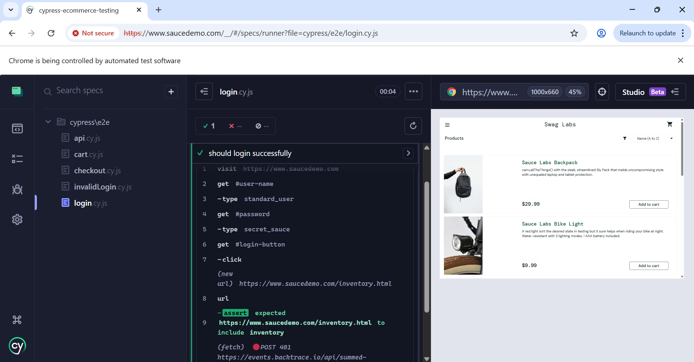
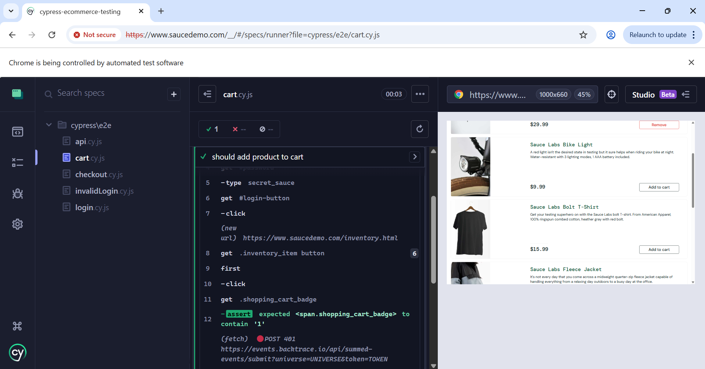

## 🔗 Live Test Demo

Run locally using Cypress:
npx cypress open

# Cypress E-commerce Testing

This project demonstrates UI and API testing using Cypress.

## Test Results

### Login Test



### Cart Test



### Checkout Flow


# Cypress E-commerce Testing Project

This project shows UI and API testing using Cypress on a real e-commerce website.

## Project Overview

I used SauceDemo to automate important user actions like login, adding items to cart, and completing checkout.

## Test Coverage

### UI Tests

- Valid login
- Invalid login
- Add product to cart
- Complete checkout flow

### API Test

- GET users from ReqRes API
- Response validation

## Tools Used

- Cypress
- JavaScript
- SauceDemo
- ReqRes API

## Project Structure

```text
cypress/
  e2e/
    login.cy.js
    cart.cy.js
    checkout.cy.js
    invalidLogin.cy.js
    api.cy.js
support/
  commands.js
```
