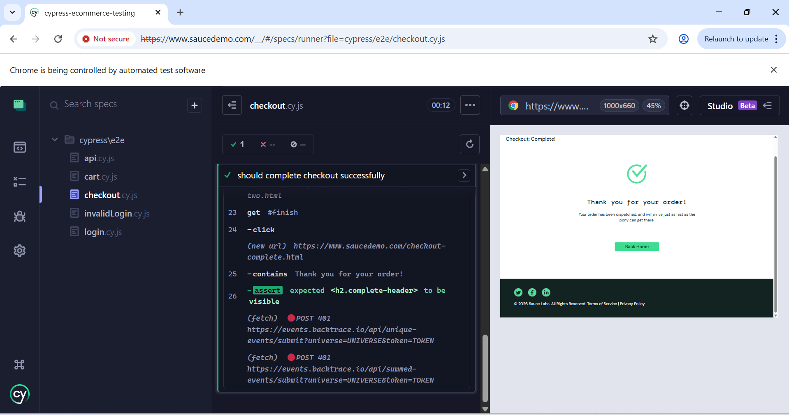

# Cypress E-commerce Testing

This project demonstrates UI and API testing using Cypress.

## Test Results

### Checkout Flow

## Test Coverage

- Valid login
- Invalid login
- Add product to cart
- Complete checkout flow
- Basic API validation

## Tools Used

- Cypress
- JavaScript
- SauceDemo
- ReqRes API

## How to Run

1. Install dependencies
2. Run `npx cypress open`
3. Open the spec files in `cypress/e2e`
